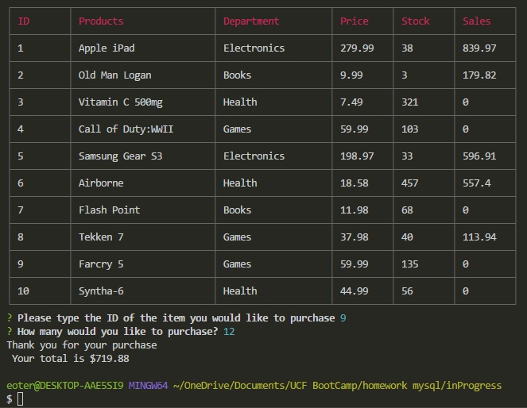
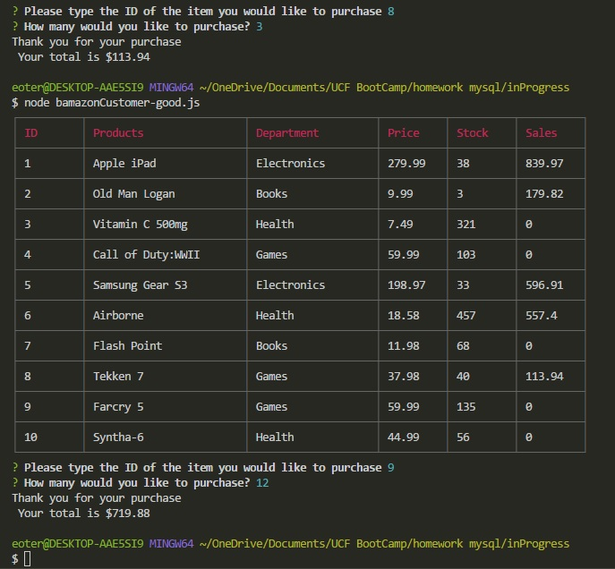

# Bamazon

Stock and Inventory CLI app
Using Node.js, MySql.
-Inquirer terminal prompts, and CLI-tables

## Bamazon Customer

View list on items in stock.
You may purchase an item by its ID, and select a quantity.
The quantity will be removed from the inventory, and you will see your total.

## Bamazon Manager

View list on items in stock.
View low stock inventory.
Add to the current inventory.
Add a new product and update the database.

